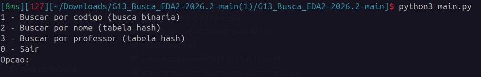

# G13_Busca_EDA2-2026.2

## Busca Matérias UnB Gama

Projeto desenvolvido para a disciplina de **Estruturas de Dados e Algoritmos 2 (EDA2)**.

O programa permite buscar disciplinas ofertadas na **FCTE - UnB Gama** por código, nome ou professor.

## Alunos

| Matrícula | Nome |
| --- | --- |
| 22/2037675 | Gabriel Santos Pinto |
| 23/1030691 | Guilherme Ferreira Brandão |

## Sobre o projeto

A base utilizada possui **134 disciplinas do período 2026.2**.

As buscas disponíveis são:

- **Código:** busca binária;
- **Nome:** tabela hash;
- **Professor:** tabela hash.

Os dados das disciplinas estão no arquivo `data/disciplinas.json` e foram obtidos a partir da consulta pública de turmas do SIGAA da UnB.

## Como executar

Basta rodar o arquivo `main.py`. O menu será exibido no terminal.

## Exemplo

## Fonte dos dados

Os dados foram retirados da página pública do SIGAA da Universidade de Brasília.

## Vídeo de apresentação

