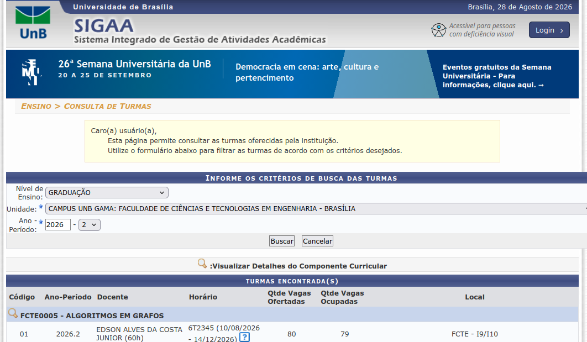

# G13_Busca_EDA2-2026.2

## Busca_MateriasUnbGama

## Alunos  
| Matrícula | Nome |  
|-----------------------|---------------------|  
| 22/2037675 | GABRIEL SANTOS PINTO |  
| 23/1030691 | GUILHERME FERREIRA BRANDAO |  

## Descrição do projeto

O projeto consiste no desenvolvimento de um buscador de matérias da FCTE UnB-Gama, com o objetivo de facilitar a consulta de disciplinas pelos alunos.

A aplicação utiliza algoritmos de busca estudados na disciplina de Estruturas de Dados e Algoritmos 2 (EDA2), permitindo localizar disciplinas de forma eficiente a partir de informações como código ou nome da matéria.

## Guia de instalação

### Dependências do projeto

### Como executar o projeto

1. Clone o repositório:

git clone <url-do-repositorio>

## Capturas de tela
Retiramos os dados da Página Pública do SIGAA, que é a plataforma oficial da UnB para consulta de disciplinas e informações acadêmicas.

## Conclusões

## Referências